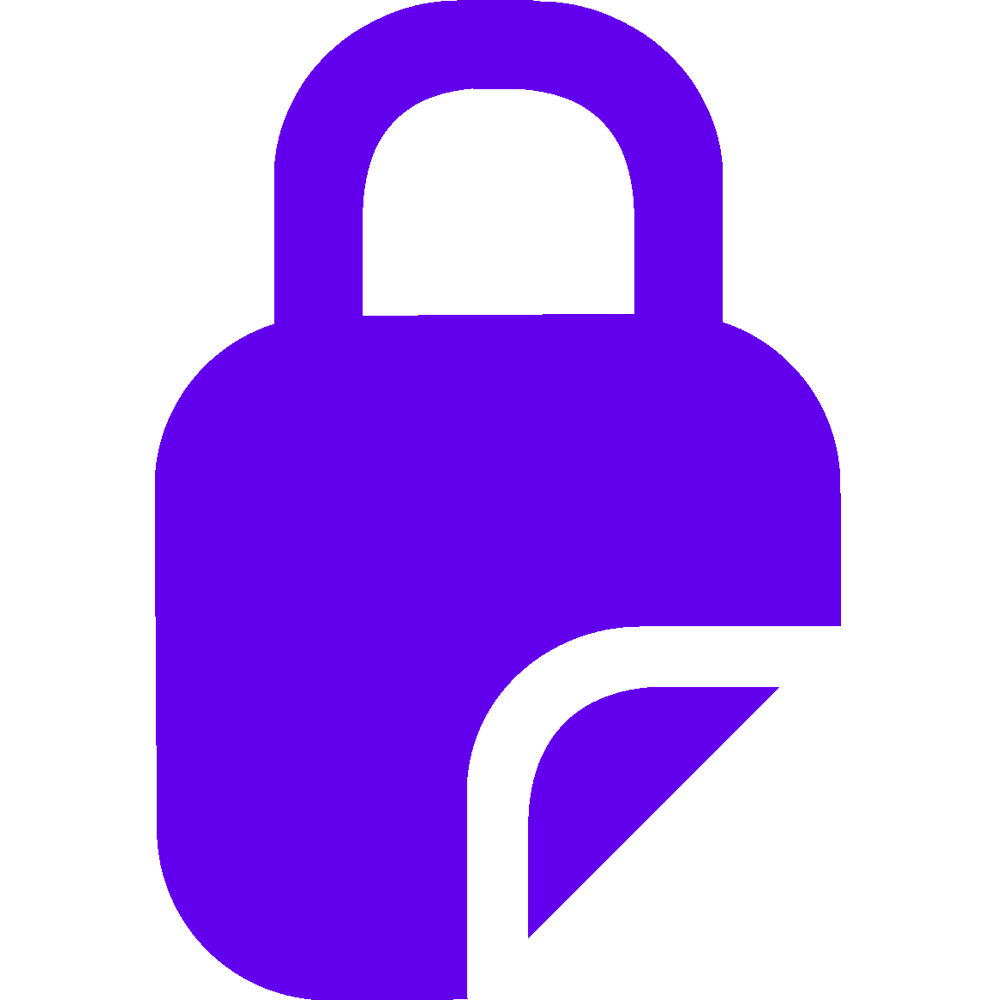
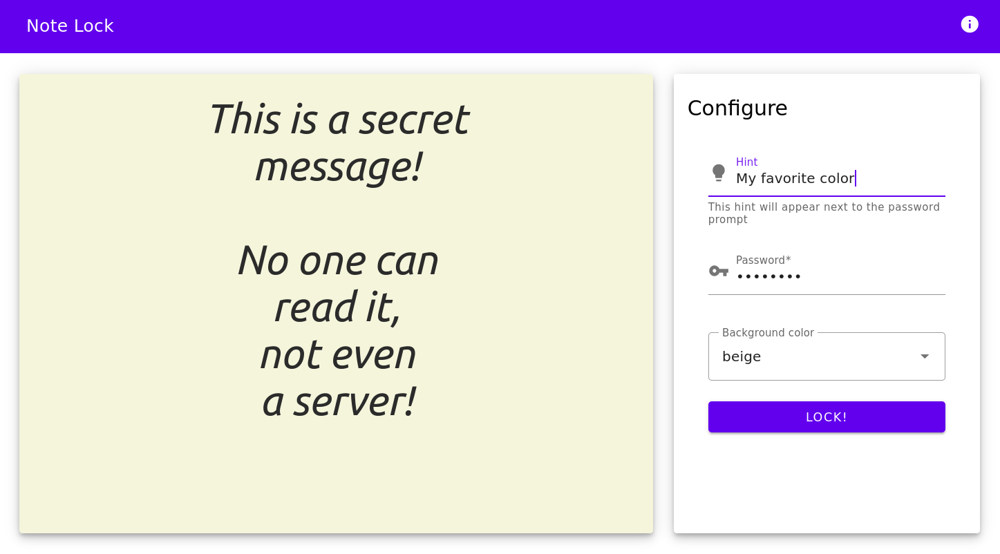
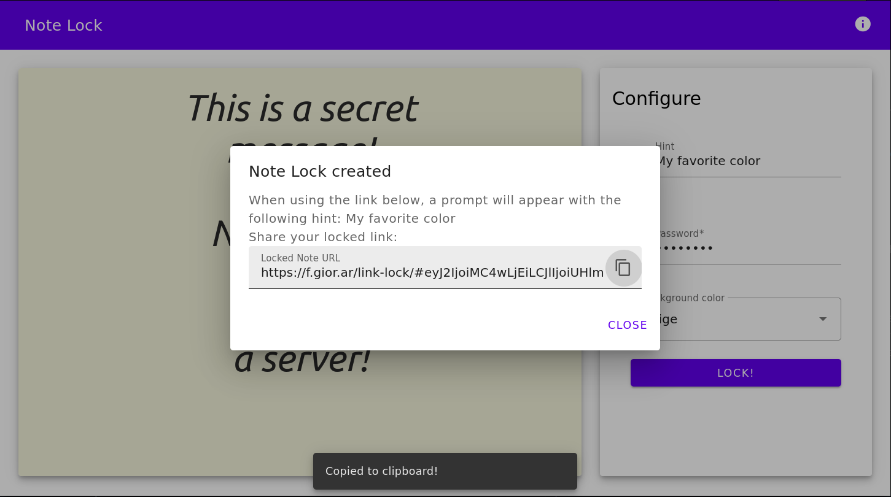
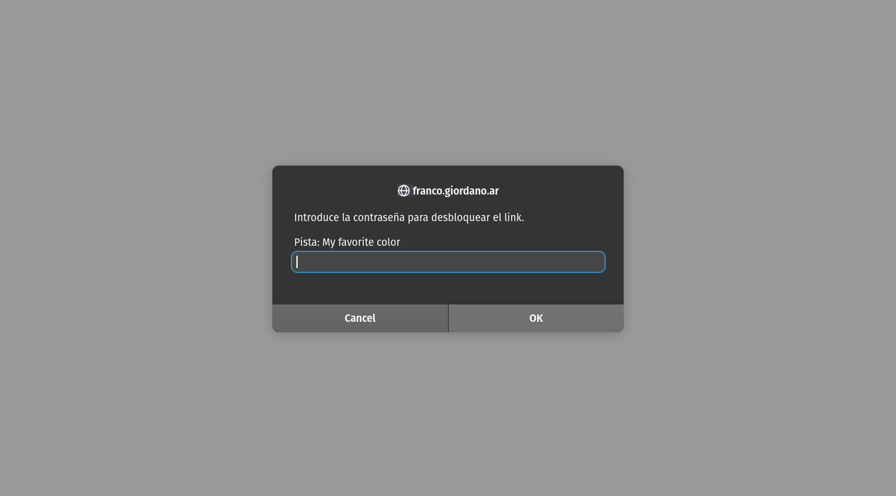

    
    <h1 align="center">Note Lock</h1>

  
  

Send encrypted notes without any server! Your encrypted message lives only in the URL, and is never sent anywhere.

Encryption and render methods designed by <a href="https://github.com/jstrieb/link-lock">jstrieb/link-lock</a> and <a href="https://github.com/jstrieb/urlpages">jstrieb/urlpages</a>. Built with Svelte.

## Showcase
First, enter your message, an optional hint and password. Click in Lock! and copy your encrypted message (URL):  

Send the URL. The recipient will open it and find the password prompt. After using the right password, you will find the message!

Remember: your message is never sent anywhere, encryption+decryption happens all client-side. There is no backend, this project is just a static HTML!

## Next steps

Some extra desired features/fixes are:
- Offer a shortened URL for easy sharing (i.e. TinyUrl)
- Generate a QR code for the (shortened) URL
- Add Information button explaining project goals
- Better background color options
- ... and more!

## Contribute

1. Clone repo
2. Install npm packages: `npm install`
3. Start the server (with hot reloading): `npm run dev`
4. Navigate to [localhost:5000](http://localhost:5000)

<!-- 
## Next steps

You can see our to-do list in [this project](https://github.com/franco-giordano/note-lock). Feel free to work on any of these issues! -->

## License

MIT
